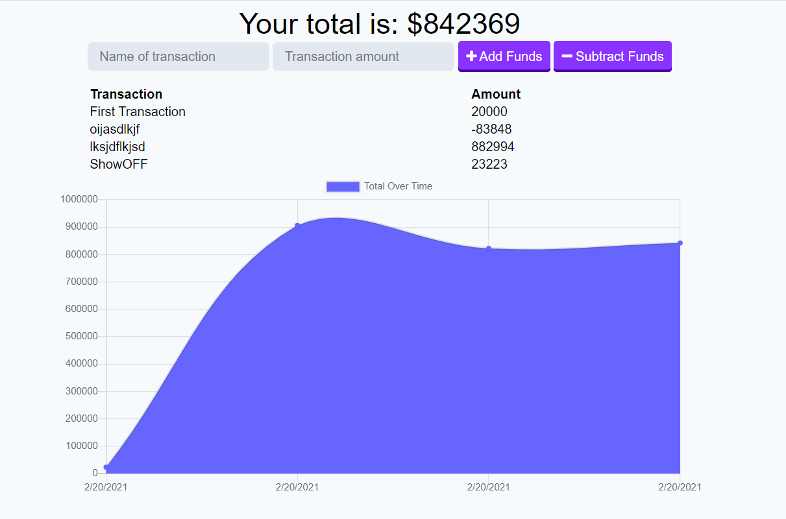

# PWA

## Description

A Full Stack web application built with express, node and indexDB. With this application you can keep track of your finances by adding expenses and income.

## Table of Contents

* [Installation](#installation)
* [Usage](#usage)
* [License](#license)

## Installation

1. Clone repository. 
2. npm install
3. node server.js

    

## Usage

The usage of this app is all transactions can be done when offline. The app updates the database when back online.

Data can be visualized using chart in the front end.

### Demo

### Built With

 

    
    
    
    
    
    
    

## License

 

    

